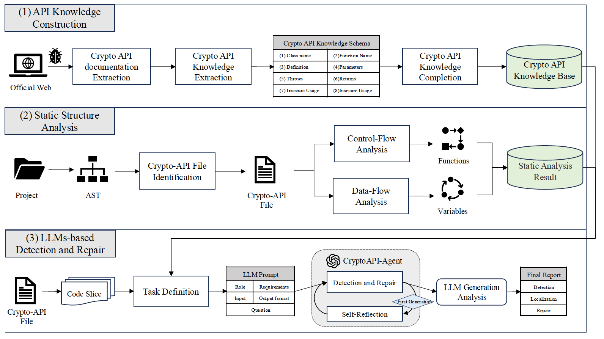
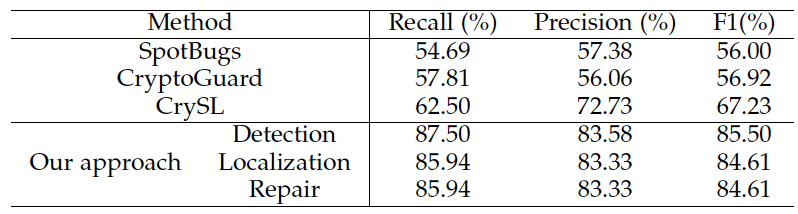
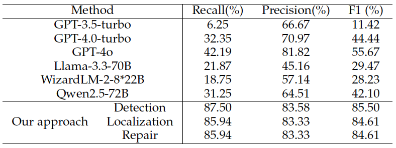

# Descriptions

Code and result for: Detecting and Repairing Project-Level Misuse of Java Crypto API with Large Language Models

# Abstract

Java crypto application programming interface (API) is critical in ensuring confidentiality, data integrity, authentication, and authorization of software systems. However, crypto API misuse remains a significant challenge due to its complexity. Conventional rule-based approaches employ predefined rules to detect crypto API misuses. Although effective in some cases, this sophisticated method is prone to generating high false positives. In contrast, recent advances in large language models (LLMs) have demonstrated their exceptional capability in code-understanding tasks. Yet, limited attention has been given to addressing crypto API misuse. To bridge this gap, we first conduct a pilot study on the crypto API misuse detection with LLMs in the two Java projects. We identified two major challenges hindering detection performance: insufficient project-level context understanding and limited crypto API knowledge awakening. In response, we propose a novel approach to enhance LLM-based detection and repair of project-level crypto-API misuses. Our comprehensive framework comprises three key components: (1) API knowledge construction, (2) project-level static structural analysis, and (3) LLM-based detection and repair. Extensive experimental results demonstrate that our approach significantly outperforms both rule-based methods and LLM-based baselines regarding detection accuracy, vulnerability localization, and repair effectiveness. The ablation study also highlights the contribution of each framework component, showing substantial improvements in all evaluation metrics. Furthermore, we also identified 10 previously unreported instances of crypto-API misuse in the benchmark. These findings underscore the promising potential of LLMs for the detection and repair of crypto API misuse, paving the way for more reliable and efficient cryptographic practices in software systems.

# Framework

# Result

## Comparison with rule-based approaches

## Comparison with LLM-based approaches

# Code

Comming soon .....