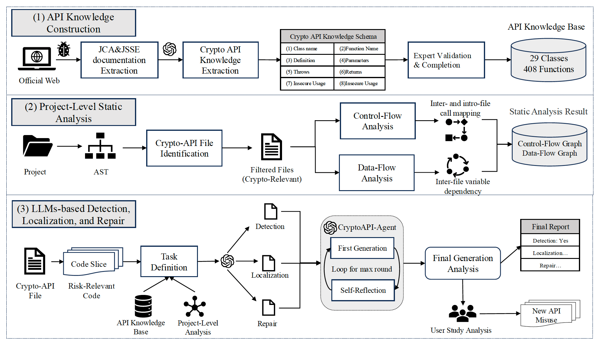
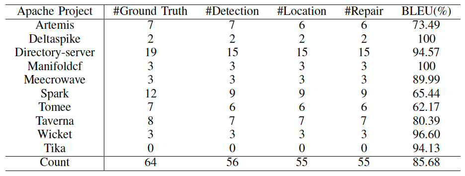
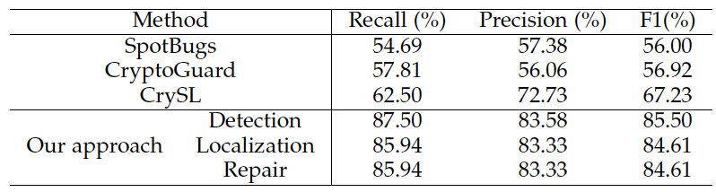
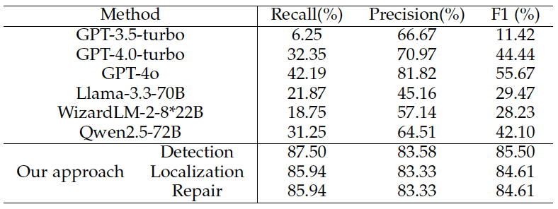
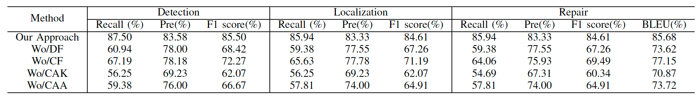

# Our work

SmartFix: Detecting and Repairing Project-Level Misuse of Java Cryptography APIs with LLMs

# Abstract

Java crypto APIs are essential for ensuring confidentiality, data integrity, authentication, and authorization of software, yet their misuse remains challenging due to inherent complexity and evolving security standards. Traditional rule-based approaches rely on predefined patterns but often suffer from high false positives, whereas LLMs demonstrate strong code understanding but remain underexplored for project-level crypto reliability assurance. To address this, we conduct a pilot study and identify two key challenges: insufficient activation of domain-specific crypto API knowledge and inadequate project-level contextual awareness. In response, we propose SmartFix, a reliability-grounded framework integrating expert-validated API knowledge construction, context-aware static analysis, and iterative self-correction for project-level crypto API misuse detection and repair. Experimental results on the ApacheCryptoAPI-Bench show that SmartFix significantly outperforms state-of-the-art rule-based and LLM-based baselines. Ablation studies confirm the statistical significance of each component’s contribution. Additionally, we report 9 previously unreported crypto API misuses validated via a controlled user study, paving the way for more reliable and efficient crypto practices in software systems.

# Framework

# Result

## Overall Performance

## Comparison with rule-based approaches

## Comparison with LLM-based approaches

## Ablation Study

# Code

CryptoAPI_Agent.py

Crypto_API_Knowledge_base/extract_knowledge.py  

extract_call_chain.py

extract_code_slice.py

judge_API.py

pre_baseline.py
=======

